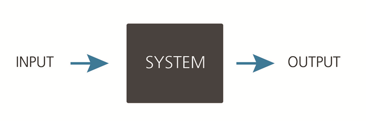

Skuldsku
========

Skuldsku is a Java library for automating input/output based regression testing. The most common use case for the library is the recording of inputs and outputs from a system in a production environment, and using the recorded data in order to run regression tests on a new version of the system.

# Features
* Records requests and responses from: HTTP, Java interface implementations and database.
* Playback of recorded HTTP requests even when there is CSRF-protection.
* Mocking of simple Java interfaces when running tests.
* Comparison and reporting of differences between production and test output.

# Modules
|Module                   |Description|
|:------------------------|:----------|
|[skuldsku&#8209;prod](skuldsku-prod)      |The dependency you need to include in your application in order to record production data.|
|[skuldsku&#8209;testrunner](skuldsku-testrunner)|Functionality for executing a regression test. Normally included as a dependency in a separate project for executing tests for a single application.|
|[examples](examples)|Examples on how to use Skuldsku.|

# License
Skuldsku is licensed under [LGPL version 2.1 or later](LICENSE.txt).

 

-------------------------
Copyright (C) 2014 Steria
